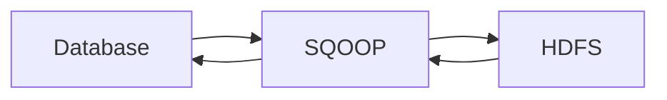
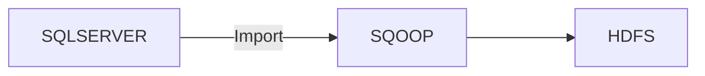
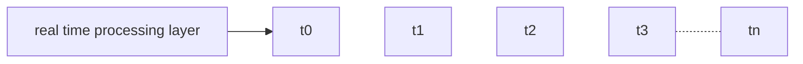

# Introduction to Big Data

Big data has high:
- volume
- variety
- velocity
- veracity 
- value

### Big data in different sectors:
#### Banking Sector
> transaction data
- loan
- credit score
#### Healthcare
> images xray, MRI, CT, ECG
- personalized diagnosis
- fodd recomendations etc.
#### Energy
> by forcasting requirements
- Common energy consumption

#### Technology
- advancements in technologies
#### Consumer
- forecasting products to users based previous purchase data
- predicting product demand
- managing logistics
- Online grocery stores:
  - instamart
  - Bigbasket
#### Manufacturing
- Manufacturing decisions

### Traditional Decision Making
- takes long time to arrive at decision and losing competitive advantage
- Requires human intervention
  - before ETL pipleines
  - regular failure due to manual interventions
- Lacks systematic inkage among strategy planning executions and reporting
  - due to limitaions of storage.
- provides limited scope of data analytics that provides only bird eye view
  - due to cost cutting and limited resources.
  - only analyses small amount of data.
  - It was not the actually analysis
  - no fully informed decision
- Obstructs company's ability to make fully informed decison
### Big Data Analytics
- Decision makeing based on data analytics
- coprehensive view of the overall pricture which is a result of analysing data from various sources
  - SQL, noSQL, URL, API, 
- streamlines decision making from from top to bottom
- helps in analysing unstructured data
- helps in faster decision making, saves time and energy
  - competative advantage
  - saves time
-----
> various tools where available under various frameworks
-----

### What is big data?
> Extremely large data sets that may be analyzed computationally to reveal pattern trends and associations, especially relating to human begaviour and interactions.
- clusters
  - How data is related.
- trend analysis:
  - line plot: forecasting
  - timeseries forecasting
  - LSTM, ARIMA: 
- associations
  - {Bread, Butter} -> {Jam}
  - {Beer} -> {Diapers}
  - data mining
  - recommendation systems
  - appriori: market basket analysis
### Four Vs of bigdata
- Volume
  - size of the data
  - overall amount of information produced
- Variety
  - four types of data
    - structured
    - semistructured
    - quasi structures
    - unstructured
  - social media, CRM systems, e-mails audio or video
  - analytic tools to segregate groups data based on type
- Veracity
  - truthfulness of the data
  - discrepancies in data
- Velocity
  - at what rate the data is being generated
- Value
  - data should add data to the company
  - informative data

#### Different types of data
- structured:
  - tabular format
  - defined datamodel, format structure
  - rows, columns
  - eg: from database, spreadsheet
- semi structured:
  - textual data files with an apparent pattern.
  - structure is not fixed for all
  - eg: XML, CSV, JSON
- Quasi Structured
  - data with erratic formats that can be fomatted with effort and software tools
  - clickstream data
- Unstructured
  - No inherent structure
  - images, videos, pdf file, documentations
### Data analytics pipeline

#### 1. Data Sources
- click stream
- databases
#### 2. Data Ingestion Layer
- sqoop: import and export data from source (structured) to destination(HDFS- Hadoop Distributed File System).

Flume: 
  - Flume is also used for migrating data from URL(live streaming source) and collect it to store in HDFS storage(storage layer)

- Kafka is also available
#### 3. Data Collection Lyaer
- Temp storage
- kafka
#### 4. Data storage
ta Storage
- S3
- HDFS
#### 5. Data processing layer
- Azure storage layer: bidirectional
- Batch processing  
- Realtime processing
- Hybrid processing

- **stram processing**

sqlserver: source
sqoop: no intermediaee storage
hdfs: destination, huge volume: apply analysis --> batch processing
- **real time processing**

- **Hybrid processing**
  - batch processing + realtime

#### 6. Data Query Layer
- Spart SQL
- presto
- amazon redshift
#### 7. Analytics Engine
- statistic analysis
- predictive analysis
- semantic analysis
- text analysis
- **uses spark**
- spark is only for processing part not for storage
- storage is part of hadoop
#### 8. Data Visualization layer
- Databricks
- PowerBi
- Tableau
#### 9. Data Secuirty layer
- in the cloud
- firewalls
#### 10. Data monitoring layer
- for administrators
- HDInsight to create a cluster, dashboards
