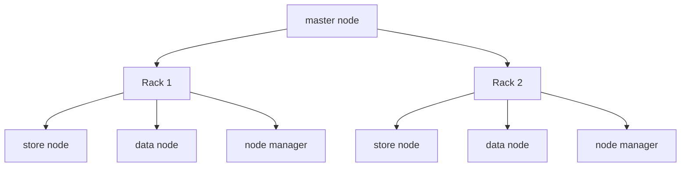
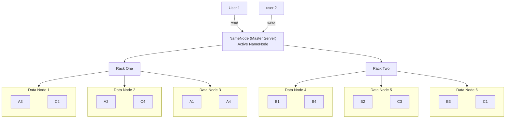
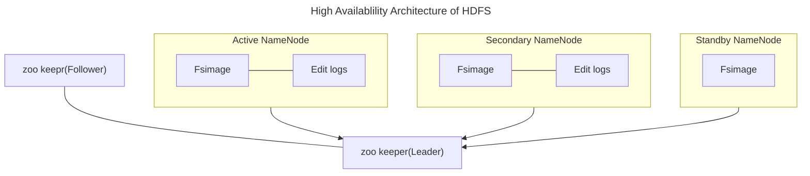
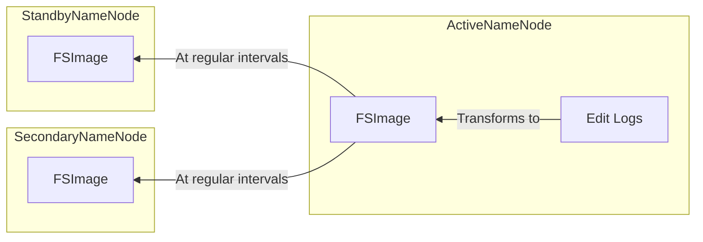

# Hadoop
### Traditional Vs. Distributed 
- Horizontal scaling:
  - adding new machines
- Vertical scaling :
  - adding new resources qhich are already present int the seystem'

Scalability in big data:
- A scalable data platform accomodates rapid changes in the growth of da either in traffic or volume
- add hw or sw to increase the thoroughput and storage.
- Scale up and Scale down.
- potential of growth in data needs.

Fault tolerence in big data:
- working strength of the system in unfavourable conditions and how that system can handle such a situation.
- HDFS also maintains the replication factor by cerating a replica of data on other available machines in the cluster in one machine fails.

Data Inconsistency is BIg Data:
- Incosistent of conficing peomena can occur at various granularities.
- It occurs from knowledge content, data information, knowledge, meta knowledge to expertise and can adversely affect ehe quality of the outcomes in big data analysis.
- monitoring every change in the data.

### Distibuted systems:
> a distributed system is model in which components located on networkded computers communicate and coordinate their actions by passing messages.
- challenges:
  - system failure
  - limited bandwidth
  - high programming complexity
### What is Hadoop
> Hadoop is a framework that allows distributed processing of large datasets across clusters of commodity computers using simple programming models.

- Storage: HDFS
- Processing: Mapreduce
- Resource negotiator: YARN

**Characteristics:**
- Highly scalable
- Flexible
- Economical
- Reliable
  - highly available
  - mutliple copies of same data
  - stores them in different machines

#### Traditional System vs Hadoop:
|feat|traditional|hadoop|
|-|-|-|
||data sent to the program|program sent to the data|
|data type|Structured|mutli and unstructured(tabular, semi/un structured)|
|processing|Limited, No data processing|processing coupled with data|
|governance|Standard and structured governance(fixed structure)|loosely structured(no fixed structure)|
|schema|required on write|required on read|
|speed|reads are fast|writes are fast|
||read many write many|read many write once|
|cost|software licence|support only|
|resources|known entity|growing complexities, wide|
|best fit use|oltp complex acid transations Operationsal data store|data discovery processing unstructured data Massive storage/processing|

### Hadoop Ecosystem:
**Hadoop Configuration**

Modes of hadoop configuration:
- standlone
  - all hadoop services runs in a single vm on a single machine
- pseudo distributed mode
  - each hadoop runs on its own JVM, but on a single machine
  - `learning stage`
- Fully distributed mode:
  - runs of individual JVM
  - These resides in seperate commodity machine in single cluster
  - `enterprice level`

 

`Master node:`
- Master series
- name node
- resource manager

#### Hadoop has 3 components:
- `HDFS`: hadoop distributed file system.
  - For the distributed storage.
- `YARN`: Yet Another Resource Negotiator.
  - For efficient resource management while processing data.
- `MapReduce`: MapR
  - Programming methodology.
#### HDFS Architecture:
- related to storage
- it one of the key component of hadoop ecosystem designed to store and manage large volumes of data across a distributed network of machines.
- It is designed to handle high throughput access to data and provide fault tolerence and high scalability.

##### HDFS Architecure components:
  
1. `NameNode`: 
   - It act as master server that manages metadata of the file system.
   - its main role is to keep file system information (path to the data blocks).
   - Folder Location
   - Keep track of replicas
   - File permission
2. `DataNode`: 
   - Act as a worker node and it keeps the actual block of data.
3. `Secondary NameNode`:
   - secondary name node

- Default block size of 128 MB.
- So 512 MB file will be seperated into 4
- all data blocks will be replicated into 3 blocks

- all data blocks will be replicated into 3 different blocks.
  - A Data Block
  - B Data Block
  - C Data Block
- NameNode tries to accesss nearest DataNode while performing read & write operations

**Conditions for write operation(allocation):**
- NameNode picks datanodes nearest to it
- NameNode distributes datanodes in a such way that all of the resources will be equally utilised by the name node
- same datablock will be never replicated in the same data node
  
> If any data nodes goes down the block present in the datanode will be replicated in other available datanodes.

**concept of multple NameNodes:**
- Active NameNode
- Secondary NameNode

Fsimage: permenant storage\
Edit logs: Read write by user, not saved yet
at a regular intervel the file will be replicated and stored in other
- at regular intervals fsimage will be copied to secondary NameNode
- same fsimage is stored in standby NameNode also.

**Check pointing**
- The primary function of secondary NameNode is to perform checkpointing
- it involves periodically merging NameNodes edit logs(changes in the file system) with current file system (FSImages)
- NameNode keeps edit log of all modifications made to the file system. Over time this log can grow large, hence we secondary NameNode helps to convert this edit logs into file system(FSImage) by creating checkpointing.   
- Overtime if edit logs can grow large, NameNodes will take more time to convert it into FSImage by restrating it, during tihs phase cluster will be down.
- Secondary NameNode helps is reducing recovery time of the cluster.
- Due to checkpointing, the downtime of cluster minimizes.

FsImages:
- File System Napespace - path to file system in clusters DataNode. (Replicas, Replica Path, File System)