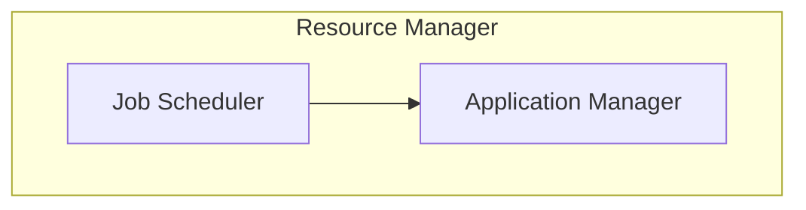

## Yet Another Resource Negotiator

- Introduced in HADOOP 2.0

### YARN Architecture

#### Job scheduler
1. When user submits a job it goes to job scheduler and it schedules the job using FIFO, FAIR, and capacity scheduler.
2. Job scheduler will allocate resources for the job.
#### Application Manager
1. Application Manager will accept the job from job scheduler.
2. It will request Node Manger to allocate Containers(RAM CPU Network, Datablocks)
3. Application Manger will monitor job execution if reuired more resources. It will request to distribute resources as required.
4. If job fails, Application Manager will request to restart job.
#### Node Manager
1. Node manaeger will allocate resource and app master to monitor containers
- App Master will monitor resources and will negotiate about resources for running job.
- App Master will running one for each job.
- App Master will kill itself once job is finished.
- They will work until the task is finished.

