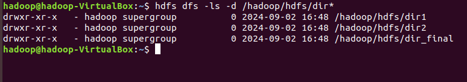
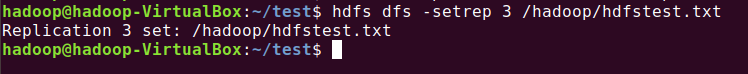

## Big Data (HDFS) Assignment
### Problem Statement: Using Command line of HDFS, perform following tasks.

#### a) Create a directory /hadoop/hdfs/ in HDFS
```bash
hdfs dfs -mkdir -p /hadoop/hdfs
```
**output:**


#### b) Create a temp directory in Hadoop. Run HDFS command to delete “temp” directory.

```bash
# create dir
hdfs dfs -mkdir /hadoop/temp

# delete dir
hdfs dfs -rmdir /hadoop/temp
```


#### c) List all the files/directories for the given hdfs destination path.
```bash
hdfs dfs -ls /
```


#### d) Command that will list the directories in /hadoop folder.
```bash
hdfs dfs -ls /hadoop | grep '^d'
```


#### e) Command to list recursively all files in hadoop directory and all subdirectories in hadoop directory
```bash
hdfs dfs -ls -R /hadoop
```


#### f) List all the directory inside /hadoop/hdfs/ directory which starts with 'dir'.
- approach one:
```bash
hdfs dfs -ls -d /hadoop/hdfs/dir*
```


#### g) Create a temp.txt file. Copies this file from local file system to HDFS
```bash
# create fil
touch temp.txt

# copy this to hdfs
hdfs dfs -put ./temp.txt /hadoop/hdfs/
```


> alternative:\
> hdfs dfs -copyFromDevice ./temp.txt /hadoop/hdfs/

#### h) Copies the file from HDFS to local file system.
```bash
hdfs dfs -get /hadoop/hdfs/temp.txt .
```


#### i) Command to copy from local directory with the source being restricted to a local file reference.
```bash
hdfs dfs -copyFromLocal ./file.txt /hadoop/hdfs
```


#### j) Command to copies to local directory with the source being restricted to a local file reference.
```bash
hdfs dfs -copToLocal /hadoop/hdfs/file.txt .
```


#### k) Command to move from local directory source to Hadoop directory.
```bash
hdfs dfs -moveFromLocal ./to_move /hadoop/hdfs/
```


#### l) Deletes the directory and any content under it recursively.
```bash
hdfs dfs -rm -r /hadoop/hdfs/
```


#### m) List the files and show Format file sizes in a human-readable fashion.
```bash
hdfs dfs -ls -h /hadoop/
```


#### n) Take a source file and outputs the file in text format on the terminal.
```bash
# display source file in local
cat sample.txt
```


#### o) Display the content of the HDFS file test on your /user/hadoop2 directory.
```bash
# displaying content of file in hdfs
hdfs dfs -cat /hadoop2/sample.txt
```


#### p) Append the content of a local file test1 to a hdfs file test2.
```bash
hdfs dfs -appendToFile ./to_append.txt /assignment/file.txt
```


#### q) Show the capacity, free and used space of the filesystem
```bash
hdfs dfs -report
```


#### r) Shows the capacity, free and used space of the filesystem. Add parameter Formats the sizes of files in a human-readable fashion.
```bash
hdfs dfs -df -h
```


#### s) Show the amount of space, in bytes, used by the files that match the specified file pattern.
```bash
hdfs dfs -du -s /hadoop/hdfs/*txt
```


#### t) Show the amount of space, in bytes, used by the files that match the specified file pattern. Formats the sizes of files in a human-readable fashion.
```bash
hdfs dfs -du -h /hadoop/hdfs/*txt
```


#### u) Check the health of the Hadoop file system.
```bash
hdfs fsck /
```


#### v) Command to turn off the safemode of Name Node.
```bash
hdfs dfsadmin -safemode leave
```


#### w) HDFS command to format NameNode.
```bash
hdfs dfsadmin -format
```


#### x) Create a file named hdfstest.txt and change it number of replications to 3.
```bash
hdfs dfs -setrep 3 /hadoop/hdfstest.txt
```


#### y) Write command to display number of replicas for hdfstest.txt file.
```bash
hdfs dfs -stat %r /hadoop/hdfstest.txt
```


#### z) Write command to Display the status of file “hdfstest.txt” like block size, filesize in bytes.
```bash
hdfs dfs -stat "%b %o" /hadoop/hdfstest.txt
```


#### aa) Write HDFS command to change file permission from rw – r – r to rwx-rw-x for hdfstest.txt.
```bash
hdfs dfs -chmod 761 /hadoop/hdfstest.txt
```
