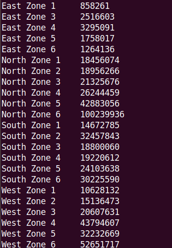
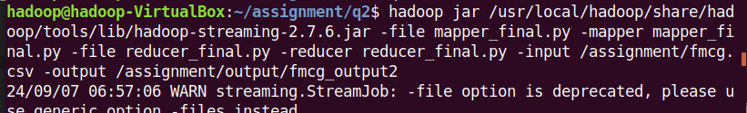
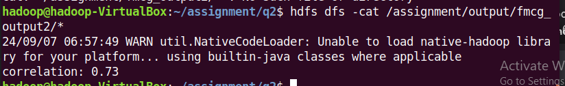
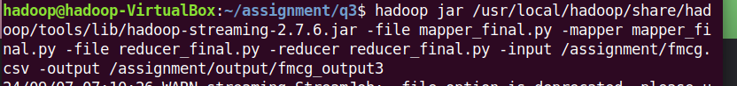
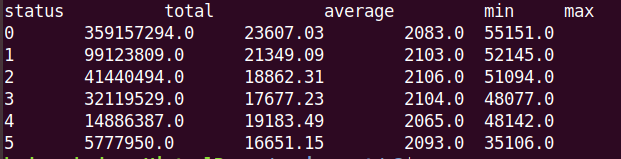
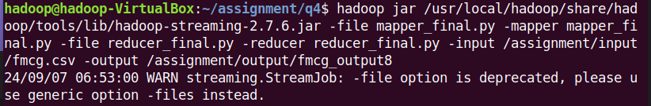
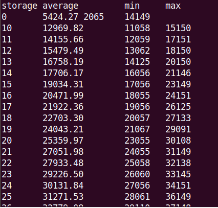

## Assignment 6 - FMCG MapReduce Analysis
### Task 1: Demand-Supply Mismatch Analysis
- Objective: Identify zones and regional zones with the highest mismatch between demand and supply.
- Required Fields: zone, WH_regional_zone, product_wg_ton
  
**Description:**
- Map: For each warehouse, emit the zone and regional zone as the key and the product weight
shipped in the last three months as the value.
- Reduce: Aggregate the product weight by zone and regional zone to calculate the total supply. Compare this with known demand data to identify mismatches.

mapper:
```python
#!/usr/bin/python3
"""mapper.py"""
import sys

for line in sys.stdin:

    try:
        line = line.strip().split(',')

        zone = line[4]
        WH_regional_zone = line[5]
        product_wg_ton = int(line[-1])
    except:
        continue

    print('%s %s\t%s' % (zone, WH_regional_zone, product_wg_ton))
```
reducer:
```python
#!/usr/bin/python3
"""reducer.py"""
import sys

current_zone = None
current_wg = 0
word = None

for line in sys.stdin:

    line = line.strip()
    zone, product_wg = line.split('\t')

    try:
        product_wg = int(product_wg)
    except ValueError:
        continue

    if current_zone == zone:
        current_wg += product_wg
    else:
        if current_zone:
            print ('%s\t%s' % (current_zone, current_wg))
        current_zone = zone
        current_wg = 0

if current_zone == zone:
    print ('%s\t%s' % (current_zone, current_wg))
```
output


### Task 2: Warehouse Refill Frequency Correlation
- Objective: Determine the correlation between warehouse capacity and refill frequency.
- Required Fields: WH_capacity_size, num_refill_req_l3m

**Description:**
- Map: Extract the number of refill requests (num_refill_req_l3m) and warehouse capacity size
(WH_capacity_size) for each warehouse. (For each warehouse, emit the capacity size and the
number of refill requests as the value)
- Reduce: Aggregate the refill requests by capacity size and calculate the correlation.
  
mapper:
```python
#!/usr/bin/python3
"""mapper_final.py"""

import sys

for line in sys.stdin:

    lines = line.split(',')

    wh_capacity = lines[3].strip()
    num_req_fill = lines[6].strip()

    try:
        if wh_capacity == 'Small':
            wh_capacity = 0
        elif wh_capacity == 'Mid':
            wh_capacity = 1
        elif wh_capacity == 'Large':
            wh_capacity = 2
        else:
            continue
        num_req_fill = int(num_req_fill)
    except ValueError:
        continue

    print(f"{wh_capacity},{num_req_fill}")
```
reducer:
```python
#!/usr/bin/python3
"""reducer_task2.py"""
import sys
import numpy as np
from collections import defaultdict

capacity = defaultdict(list)

for line in sys.stdin:
    line = line.strip()

    try:
        wh_capacity, num_req_fill = line.split(',')
        wh_capacity = int(wh_capacity)
        num_req_fill = int(num_req_fill)
    except ValueError:
        continue

    capacity[wh_capacity].append(num_req_fill)

wh_capacities = np.array(list(capacity.keys()))
avg_fill = np.array([np.mean(val) for val in capacity.values()])

corr = np.corrcoef(wh_capacities, avg_fill)
print("correlation: %.2f" %  corr[0, 1])
```
output



### Task 3. Transport Issue Impact Analysis
Objective: Analyse the impact of transport issues on warehouse supply efficiency.
- Required Fields: transport_issue_l1y, product_wg_ton

**Description:**
- Map: For each warehouse, emit whether a transport issue was reported and the product weight shipped.
- Reduce: Aggregate the product weight by transport issue status to assess the impact.

mapper:
```python
#!/usr/bin/python3
"""mapper_final.py"""
import sys

for line in sys.stdin:
    lines = line.strip().split(',')
    product = lines[-1]
    transport = lines[7]
    try:
        if int(transport) > 0:
            transport = 'Issue Occured'
        else:
            transport = 'No Issues'
    except:
        continue

    print(f"{transport},{product}")
```
reducer:
```python
#!/usr/bin/python3
"""reducer_final.py"""
import sys

curr_transport = None
curr_sum = []
curr_count = 0

print('status\t\ttotal\t\taverage\t\tmin\tmax')
for line in sys.stdin:
    line = line.strip()

    try:
        transport, product = line.split(',')
        product = float(product)
    except ValueError:
        continue

    if transport != curr_transport:
        if curr_transport is not None:
            print("%s\t%s\t%.2f\t%s\t%s" % (curr_transport, sum(curr_sum), (sum(curr_sum) / len(curr_sum)), min(curr_sum), max(curr_sum)))

        curr_transport = transport
        curr_sum = []
        curr_count = 1
    else:
        curr_sum.append(product)
        curr_count += 1

if curr_transport is not None:
    print("%s\t%s\t%.2f\t%s\t%s" % (curr_transport, sum(curr_sum), (sum(curr_sum) / len(curr_sum)), min(curr_sum), max(curr_sum)))
```
output


#### method 2



### Task 4. Storage Issue Analysis
- Objective: Evaluate the impact of storage issues on warehouse performance.

- Required Fields: storage_issue_reported_l3m, product_wg_ton

**Description:**
- Map: For each warehouse, emit whether a storage issue was reported and the product weightn shipped.

- Reduce: Aggregate the product weight by storage issue status to assess the impact

mapper:
```python
#!/usr/bin/python3
"""mapper_final.py"""
import sys

for line in sys.stdin:
    lines = line.strip().split(',')
    product = lines[-1]
    storage = lines[-6]

    try:
        if float(storage) > 0:
            storage = 'Issue Reported'
        else:
            storage = 'No Issues'
    except:
        continue

    print(f"{storage},{product}")
```
reducer:
```python
#!/usr/bin/python3
"""reducer_final.py"""
import sys

curr_storage = None
curr_sum = []
curr_count = 0

print("status\t\taverage\t\tmin\tmax")
for line in sys.stdin:
    line = line.strip()

    try:
        storage, product = line.split(',')
        product = int(product)
    except ValueError:
        continue

    if storage != curr_storage:
        if curr_storage is not None:
            print("%s\t%.2f\t%s\t%s" % (curr_storage, (sum(curr_sum) / len(curr_sum)), min(curr_sum), max(curr_sum)))

        curr_storage = storage
        curr_sum = []
        curr_count = 1
    else:
        curr_sum.append(product)
        curr_count += 1

if curr_storage is not None:
    print("%s\t%.2f\t\t%s\t%s" % (curr_storage, (sum(curr_sum) / len(curr_sum)), min(curr_sum), max(curr_sum)))
```
output




