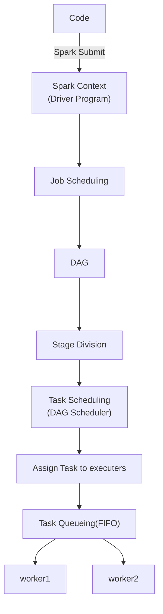

## Spark Intro
- Semi structured formats:
  - ORC, Parquet, AURO
  - They are know as big data file formats.

**Uber old infra:**
- Data sources
  - Kafka
  - key value DB (noSQL)
  - RDBMS
- Storage
  - Vertica
- Preocessing
  - ETL
    - Extract
    - Transform (mainly cleaning, preprocesing)
    - Load (to permanent storage)
  - Adhoc Analytics
  
Vertica:
- data warehouse
- landing store
- fast reliable and column oriented design

> Many challenges due to this architecture was present
 
----
> - hadoop provides batch processing
> - spark will help to achieve realtime processing or stream processing
----

Uber new infra
- Data Source
  - Same
- Storage
  - Hadoop - HDFS
- Processing
  - Spark

Spark was introduced due to realtime processing and stream processing

#### Why? 
- Hive(Hadoop ecosystem), Presto and Spark (Hive + Spark) as data warehouse enable users to easily access data.
- Parquet: Columnar storage
- Hudi: take out only incremental data(data that is modified incrementaly) - enables incremental changes.
### Data Processing
- Technique of manipulating informating. It refers to the tranformation of unstructured dat ainto meaningful and readable information.

- cleaning:
  - null, duplication, outliers, multiple format, incorrect data, indexing, inconsistancies.

**Types of data processing**:
- Batch processing
  - Bulk
- Realtime processing 
  - Catch data at regular interval and sent to spark, which will generate outcome.

#### Batch Processing
- large volume of data processed in a single batch
- data is collected over a certain period and then processed in every batch window.
- window span - over which data is collected.
- Stack data over the time period and process the data as a batch.

#### Realtime processing
- Data is processed when it is generated (regular intervals)
- we don't process previous data. only current data will be considered.
- When the data comes, it will be processed.
- eg: credit card fraud detection by banks.

### Limitations of map Reduce:

if there is multiple map jobs:

- lots of writes and reads to intermediate o/p

Hadoop:
- Hive
- Pig
- Giraph
- Tez
- Mahout

Spark have features of all of them;

**Limitations of map reduce**:
- Unsuitable for real time processing
- Unsuitable for trivial operations
  - filter
  - joins
- Unsuitable for large data on the network
- Unsuitable for OLTP
- Unsuitable for processing graphs
  - property graphs
- Unsuitable for iterative type of execution

#### Spark over map reduce
- Batch processing
- Structured data analysis
- Machine learning
- Interactive SQL
- Real time streaming data
#### Apache Spark
- suitable for realtime trivial operations and to processs larger data on a network.
- open source cluster computing framework
- upto 100 times faster performance (in memory) and 10 times faster (for indisk) (compared to MapReduce)
- Apache spark is suitable for machine learning algorithms (load and query data repeatedly)

Components of spark project
- Spark SQL
  - read from various structured data like csv avro etc.
- spark Streaming
  - fault tolerent processing of realtime data.
- MLLib
- GraphX
  - perform and manipulate graph parallel computations.
- SparkR

Spark shell or pySpark : Core spark component

### working of Apache Spark Architecture

- Driver Program:
  - executiong point of program
  - creates Spark Context to schedule job execution and negotiates with the cluster manager
  - negotiates regarding the resources
  - SparkContext object: helps in coordinating with all distributed process and allows resource allocation
  - default object name is sc which can be changed later on.
- Cluster Managers
  - spark standalone:
    - can be launched manually or when starting master and workers
  - YARN
  - Mesos
    - scalable partitioning among different spark instances
    - dynamic partitioning b/w spark and other frameworks
  - Amazone Ec2
- Executers
  - cache slotes to keep data in memory
  - task slots are java threads that run the code executors run task scheduled by the driver.
- Worker Node:
  - They are the slaev nodes that execute the tasks.

YARN Deployment Modes:
- client mode
- 
- cluster mode

When we start spark shell or pyspark, it starts two sessions by default:
1. spark context
2. spark session 

- sc needs to running always

Cluster manager:
- by deault it is in standalone mode

Spark Context:
- Spark context is the crucial component which represents connection to the spark cluster. 
- It is an entry point for using spark API, spark methodes.
- It is responsible for maintaining life cycle of the spark application
- It handles allocation of the resouces which are required by executors. 
- This manages Configuration for spark application. 
- RDD Resilient Distributed Dataset(core dataset of spark)
- RDD is the fundamental dataset of spark.
Cluster Manager:
- It schedules and dispatches tasks and jobs to the worker nodes. It ensures the tasks are distributed among the worker nodes. 
- Scaling: cluster manager is responsible for the scaling responsible up and down depending on the work load and demand.
- Handles Fault tolerence
- if job fails it can reschedule the task.
- Resource mangement(optmization of resources)
- monitors and manages the resources are utilzed efficiently
- Ensures resources are used efficient 

#### Python to byte code

#### Spark JOB execution flow:

- between workers, there will be shuffling
- Each workers have executors
- DAGs are physical execution plans