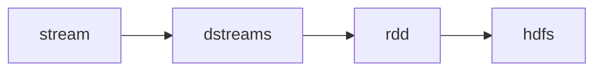

### What is streaming
- continues flow of data at a high speed rate

### Realtime dataprocessing lifecycle:
<!--  -->

</img>

Introduction to spark streaming:
- extension of core spark API
- Kafka: acts as broker
- Flume
- Kinesis
------
- SSC(Structure Streaming Context)
  - Entry point to spark streaming
- features of spark streaming:
  - scaling
  - speed
  - fault tolerence
  - integration
  - business analysis

- workflow of spark streaming

DStream discretized stream