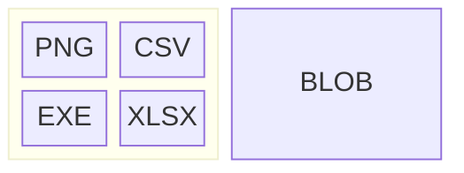
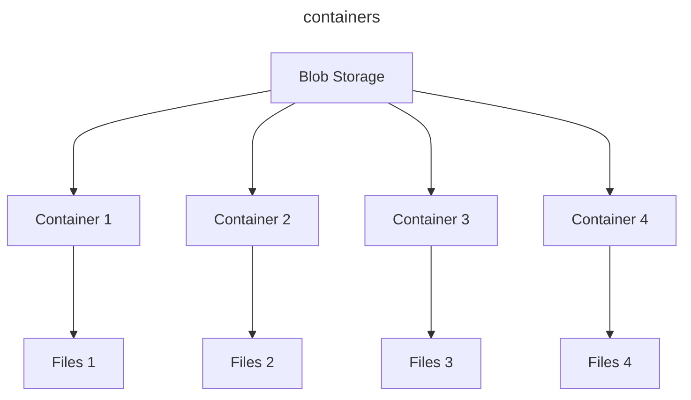
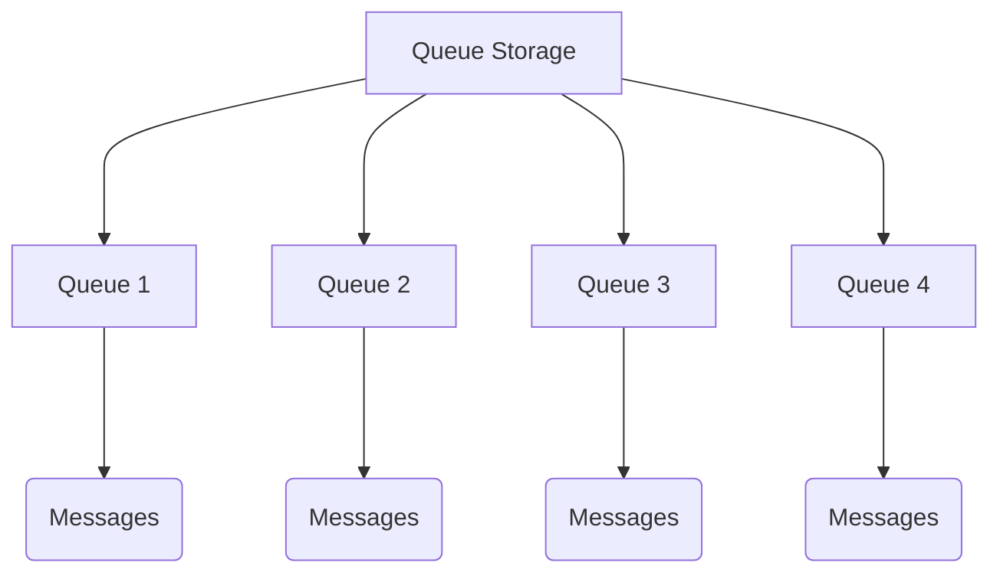
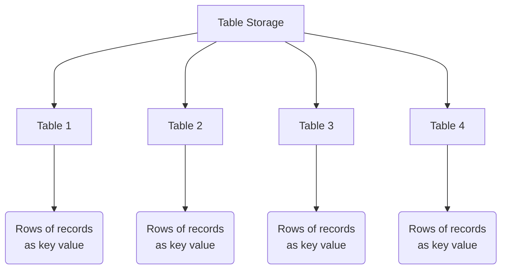
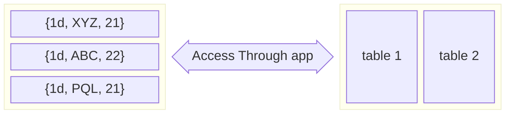
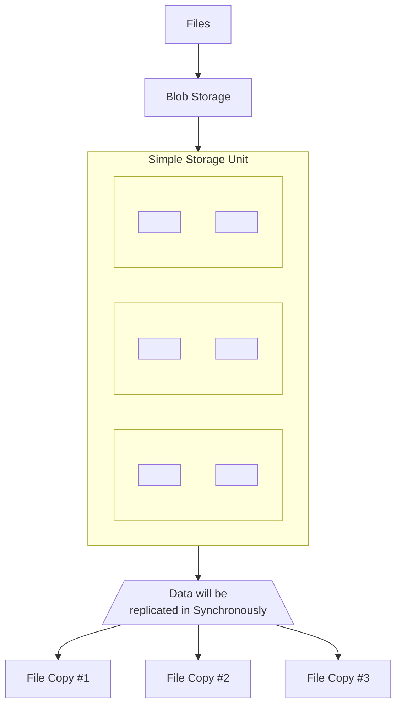

# Azure Storage:
Azure storage offers a massively scalable object store for data objects. a file system for the azure cloud, a messaging store for reliable messaging and a NoSQL store.
- Durable
- Scalable
- Secure
- Fault Tolerence
- Highly available
- Managed
- Accessible

## Types
- Blobs:
  - Highly scalable, REST based cloud object store.
- Tables:
  - .
- Queues
- Disks
- Files
- Azure Import/Export
- AZCopy

### Blob Storage:
Massively scalable object store for text as well as binary data. This is ideal for serving images or documents directly to a browser.
- blob stores files for distributed access, streaming video and audio.
- blob offers backup and restore disaster recovery and archiving. 
  

each blob file will be accessible using URI

####  Blob storage access Tiers:
Azure storage provides different options for accessing block of bolb data based on usage patterns.
- **Hot**: Optimized for frequent access of objects
- **Cool**: Optimized for storing large amount of data which is infrequently accessible and stored for atleast 30 days.
- **Archive**: Optimized for the data, that can tolerate several hours of retrival latency and it will remain in the archive tier for atleast 180 days. 

### Queue Storage:
A messaging store for reliable messaging between application components.

- Messaging queue for asynchronous communication between application components.
- It stores and retrieves messages in FIFO order.

- storage for small pieces of data, (source will generate small messages at regular intervals).
- It is usedfor Asynchronous messaging.
- Suppose reliable messaging between application and application component. 
- Highly scalable, as this can handle millions of messages per second.
- This can trigger azure services, functions for automation processing.
- This can be used for processing log message, user interaction with application and background tasks.

### Table Storage
- Azure storage table is NoSQL key value storage with fast access and schema-less design
- Highly scalable and designed for applications requiring large amount of structured, non-relational data. 
- eg: application logs as key value pairs or metadata. 
- This stores requires low latency data access and high availability.

### File Storage
- Manages files share accessible via SMB(Server Message Block) and NFS(Network File System)
- SMB Protocol is a network file sharing protocole that allows applications on cloud to read and write to files and request services from server programs.
- This can also be mounted to drives of computer.

## Data Redundancy:
- Azure storage replicates multiple copies of your data. Replications options for a storage includes: 
  - Local Redundant Storage (LRS)
  - Zone Redundant Storage (ZRS)
  - Geo Redundant Storage (GRS)

LRS: simple low cost data replication strategy. Data is replicated within a single storage.

ZRS: High availability and durability. Data is replicated synchronously across three availability zones.

GRS: Cross regional replication to protech against region wide unavailability of data.

Read-Access GRS(RA-GRS): Cross regional replicationw ith read access tot he replica.