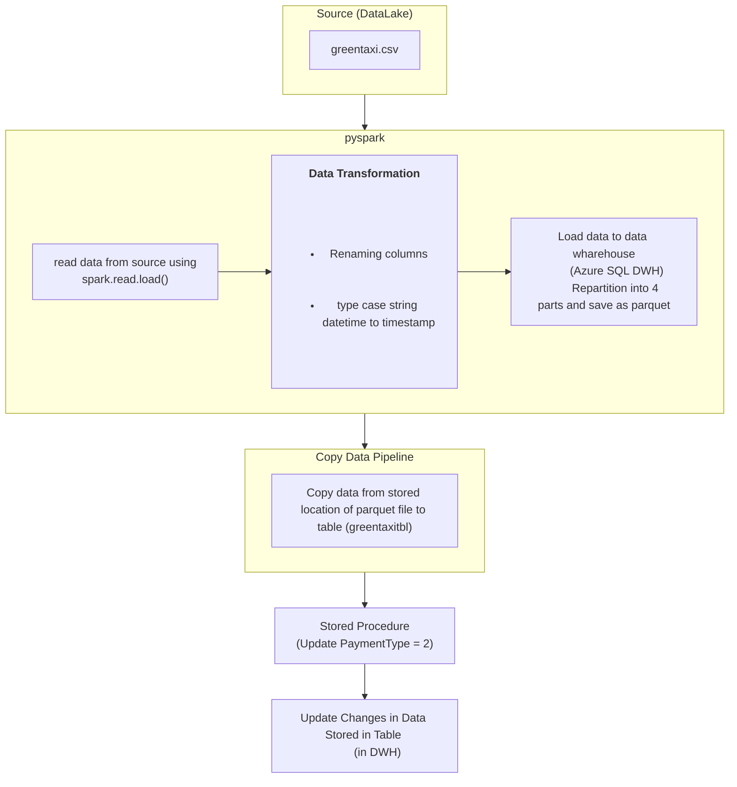

## ETL Pipeline using Azure Synapse

```mermaid
flowchart TD
    subgraph s["Source (DataLake)"]
    dl["greentaxi.csv"]
    end

    subgraph pyspark
    ps["read data from source using<br> spark.read.load()"]

    ts["<b>Data Transformation</b>
        <ul>
        <li>Renaming columns</li>
        <li>type case string datetime to timestamp</li>
        </ul>
        "]

    sql["Load data to data wharehouse
        (Azure SQL DWH)
        Repartition into 4 parts and save as parquet"]

    ps --> ts --> sql
    end

    subgraph cdp["Copy Data Pipeline"]
     cp["Copy data from stored location of parquet file to table (greentaxitbl)"]
    end

    sp["Stored Procedure
    (Update PaymentType = 2)"]

    up["Update Changes in Data Stored in Table 
        (in DWH)"]


    s --> pyspark
    pyspark --> cdp
    cdp --> sp
    sp --> up
```