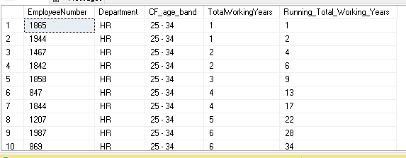
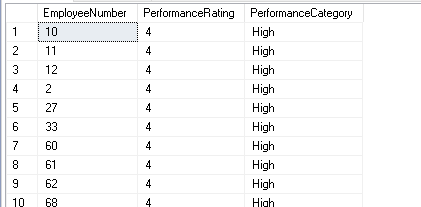

## Employee Database Analysis

### a. Return the shape of the table 

```sql
SELECT 
    (SELECT COUNT(*) FROM EmployeeData) AS row_bo,
    (SELECT COUNT(*) FROM INFORMATION_SCHEMA.COLUMNS WHERE TABLE_NAME = 'EmployeeData') AS no_columns;
```


### b. Calculate the cumulative sum of total working years for each department

```sql
SELECT 
    Department,
    TotalWorkingYears,
    SUM(TotalWorkingYears) OVER (PARTITION BY Department ORDER BY TotalWorkingYears ROWS BETWEEN UNBOUNDED PRECEDING AND CURRENT ROW) AS Cumulative_sum_year
FROM EmployeeData;
```


### c. Which Gender Has Higher Strength as Workforce in Each Department

```sql
WITH GenderCounts AS (
    SELECT 
        Department,
        Gender,
		COUNT(*) as counts,
        SUM(CASE WHEN Gender = 'Male' THEN 1 ELSE 0 END) AS Males,
		SUM(CASE WHEN Gender = 'Female' THEN 1 ELSE 0 END) AS Females
    FROM 
        EmployeeData
    GROUP BY 
        Department,
        Gender
)
SELECT 
	Department,
	Gender AS ProminentGender,
	counts,
	 RANK() OVER (PARTITION BY Department ORDER BY counts DESC) AS Gender_Rank
FROM GenderCounts;
```


### d. Create a New Column `AGE_BAND` and Show Distribution of Employee's Age Band Group
```sql
ALTER TABLE EmployeeData
ADD Age_Band NVARCHAR(50);
```

```sql
UPDATE EmployeeData
SET Age_Band = CASE 
	WHEN Age < 25 THEN 'Below 25'
    WHEN Age BETWEEN 25 AND 34 THEN '25-34'
    WHEN Age BETWEEN 35 AND 44 THEN '35-44'
    WHEN Age BETWEEN 45 AND 55 THEN '45-55'
    ELSE 'Above 55'
	END;

SELECT 
    Age_Band, 
    COUNT(*) AS Count
FROM EmployeeData
GROUP BY Age_Band;
```


### e. Compare All Marital Status of Employees and Find the Most Frequent Marital Status
```sql
SELECT 
    MaritalStatus,
    Count,
    RANK() OVER (ORDER BY Count DESC) AS Freq_Rank
FROM (
    SELECT 
        MaritalStatus, 
        COUNT(*) AS Count
    FROM EmployeeData
    GROUP BY MaritalStatus
) AS _
```


- Most frequent marital status is "Married"
### f. Show the Job Role with Highest Attrition Rate (Percentage)
```sql
WITH AttritionRate AS (
    SELECT 
        JobRole,
        (SUM(CASE WHEN Attrition = 'Yes' THEN 1 ELSE 0 END) * 100.0) / COUNT(*) AS Attrition_Percentage
    FROM EmployeeData
    GROUP BY JobRole
)
SELECT TOP 1
    JobRole,
	Attrition_Percentage
FROM AttritionRate
ORDER BY Attrition_Percentage DESC;
```


- Sales Represetatives have the highest attrition rate

### **g. Show Distribution of Employee's Promotion, Find the Maximum Chances of Employee Getting Promoted**

```sql
SELECT 
	Department,
	YearsSinceLastPromotion, 
	COUNT(*) AS EmployeeCount
FROM EmployeeData
WHERE YearsSinceLastPromotion = 0
GROUP BY Department, YearsSinceLastPromotion
ORDER BY Department, YearsSinceLastPromotion;
```


>Insight: From above data we can see that most employees from R&D Department got a most recent promotion.

```sql
SELECT 
	Department,
	JobRole,
	YearsSinceLastPromotion, 
	COUNT(*) AS EmployeeCount
FROM EmployeeData
GROUP BY Department ,JobRole, YearsSinceLastPromotion
ORDER BY EmployeeCount DESC;
```

> From further analyzing the data, we can observe that  large number of Laboratory Technicians from R&D, Sales Executives from Sales and Research Scientists from R&D Department got recent promotions.

```sql
SELECT 
	JobInvolvement,
	PerformanceRating,
	YearsSinceLastPromotion, 
	COUNT(*) AS EmployeeCount
FROM EmployeeData
GROUP BY 
	PerformanceRating,
	JobInvolvement,
	YearsSinceLastPromotion
ORDER BY YearsSinceLastPromotion, EmployeeCount DESC;
```

> From Employees who got recent promotions, we can observe their Jobinvolment and Perfomrance Rating is 3.
### h. Show the Cumulative Sum of Total Working Years for Each Department

- duplicate of b

### **i. Find the Rank of Employees Within Each Department**
Based on Their Monthly Income

```sql
SELECT 
    EmployeeNumber,
    Department,
    MonthlyIncome,
    RANK() OVER (PARTITION BY Department ORDER BY MonthlyIncome DESC) AS Income_Rank
FROM EmployeeData;
```


### j. Calculate the Running Total of 'Total Working Years' for Each Employee Within Each Department and Age Band
```sql
SELECT 
    EmployeeNumber,
    Department,
    AGE_BAND,
    TotalWorkingYears,
    SUM(TotalWorkingYears) OVER (PARTITION BY Department, AGE_BAND ORDER BY EmployeeNumber) AS Running_Total_Working_Years
FROM EmployeeData;
```


### k. For Each Employee Who Left, Calculate the Number of Years They Worked Before Leaving and Compare It with the Average Years Worked by Employees in the Same Department

```sql
WITH YearsWorked AS (
    SELECT 
        EmployeeNumber,
        Department,
        TotalWorkingYears AS Years_Worked_Before_Leaving
    FROM EmployeeData
	WHERE Attrition = 'Yes'
),
AvgYears AS (
    SELECT 
        Department,
        AVG(TotalWorkingYears) AS Avg_Years_Worked
    FROM EmployeeData
    GROUP BY Department
)
SELECT 
    Y.EmployeeNumber,
    Y.Department,
    Y.Years_Worked_Before_Leaving,
    A.Avg_Years_Worked
FROM YearsWorked Y, AvgYears A
WHERE Y.Department = A.Department AND Y.Years_Worked_Before_Leaving IS NOT NULL
ORDER BY
	Department,
	Years_Worked_Before_Leaving;
```

- In each department, employees worked for an average of 11 years.


- We can also observe sales and R&D have more employees that worked more than average years.

### l. Rank the Departments by the Average Monthly Income of Employees Who Have Left

```sql
WITH DepartmentIncome AS (
    SELECT 
        Department,
        AVG(MonthlyIncome) AS Avg_Monthly_Income
    FROM EmployeeData
    WHERE Attrition = 'Yes'
    GROUP BY Department
)
SELECT 
    Department,
    Avg_Monthly_Income,
    RANK() OVER (ORDER BY Avg_Monthly_Income DESC) AS Department_Rank
FROM DepartmentIncome;
```

- Sales have the employees who left with highest average monthly income followed by R&D.
- In HR Department, average income of employees who left are comparatively low.

### m. Find If There Is Any Relation Between Attrition Rate and Marital Status of Employee
```sql
    SELECT 
        MaritalStatus,
        (SUM(CASE WHEN Attrition = 'Yes' THEN 1 ELSE 0 END) * 100.0) / COUNT(*) AS Attrition_Percentage
    FROM EmployeeData
    GROUP BY MaritalStatus;
```


- Insight:
> Attrition rate is higher in Singles.\
> Attrition rate is lower in Married and Divorced.


### n. Show the Department with Highest Attrition Rate (Percentage)
```sql
    SELECT TOP 1 
        Department,
        (SUM(CASE WHEN Attrition = 'Yes' THEN 1 ELSE 0 END) * 100.0) / COUNT(*) AS Attrition_Percentage
    FROM EmployeeData
    GROUP BY Department
	ORDER BY Attrition_Percentage DESC;
```


### o. Calculate the Moving Average of Monthly Income Over the Past 3 Employees for Each Job Role

```sql
WITH LaggedData AS (
    SELECT 
        JobRole,
        EmployeeNumber,
        MonthlyIncome,
        LAG(MonthlyIncome, 1) OVER (PARTITION BY JobRole ORDER BY EmployeeNumber) AS PrevIncome1,
        LAG(MonthlyIncome, 2) OVER (PARTITION BY JobRole ORDER BY EmployeeNumber) AS PrevIncome2
    FROM 
        EmployeeData
)
SELECT 
	JobRole,
	EmployeeNumber,
	PrevIncome1,
	PrevIncome2,
	MonthlyIncome,
	(COALESCE(MonthlyIncome, 0) + COALESCE(PrevIncome1, 0) + COALESCE(PrevIncome2, 0)) / 
	(CASE
		WHEN PrevIncome2 IS NOT NULL THEN 3
		WHEN PrevIncome1 IS NOT NULL THEN 2
		ELSE 1
	END) AS MovingAverageMonthlyIncome
FROM 
	LaggedData;
```


### **p. Identify Employees with Outliers in Monthly Income Within Each Job Role**
```sql
WITH IncomeStats AS (
    SELECT 
        JobRole,
        EmployeeNumber,
        MonthlyIncome,
        PERCENTILE_CONT(0.25) WITHIN GROUP (ORDER BY MonthlyIncome) OVER (PARTITION BY JobRole) AS Q1,
        PERCENTILE_CONT(0.75) WITHIN GROUP (ORDER BY MonthlyIncome) OVER (PARTITION BY JobRole) AS Q3
    FROM EmployeeData
)
SELECT
    EmployeeNumber,
    JobRole,
    MonthlyIncome,
    CASE
        WHEN MonthlyIncome < Q1 - (Q3 - Q1) * 1.5 THEN 'Low'
        WHEN MonthlyIncome > Q3 + (Q3 - Q1) * 1.5 THEN 'High'
        ELSE 'Not an Outlier'
    END AS OutlierType
FROM IncomeStats
WHERE MonthlyIncome < Q1 - (Q3 - Q1) * 1.5
   OR MonthlyIncome > Q3 + (Q3 - Q1) * 1.5;
```


### **q. Gender Distribution Within Each Job Role, Show Each Job Role with Its Gender Domination**
```sql
WITH GenderCount AS
(
SELECT 
    JobRole,
    SUM(CASE WHEN Gender = 'Male' THEN 1 ELSE 0 END) AS Male_Count,
    SUM(CASE WHEN Gender = 'Female' THEN 1 ELSE 0 END) AS Female_Count
FROM EmployeeData
GROUP BY JobRole
)
SELECT
	*,
    CASE
        WHEN Male_count > Female_Count THEN 'Male'
        WHEN Female_Count > Male_count THEN 'Female'
        ELSE 'Equal'
    END AS Dominant_Gender
FROM
	GenderCount;
```


### **r. Percent Rank of Employees Based on Training Times Last Year**
```sql
SELECT 
    EmployeeNumber,
    TrainingTimesLastYear,
    PERCENT_RANK() OVER (ORDER BY TrainingTimesLastYear) * 100 AS PercentRank
FROM EmployeeData;
```


### s. Divide Employees into 5 Groups Based on Training Times Last Year
```sql
SELECT 
    EmployeeNumber,
    TrainingTimesLastYear,
    NTILE(5) OVER (ORDER BY TrainingTimesLastYear) AS Training_Group
FROM EmployeeData;
```


### t. Categorize Employees Based on Training Times Last Year as - Frequent Trainee, Moderate Trainee, Infrequent Trainee
```sql
SELECT 
    EmployeeNumber,
    TrainingTimesLastYear,
    CASE 
        WHEN TrainingTimesLastYear <= 2  THEN 'Infrequent Trainee'
        WHEN TrainingTimesLastYear <= 4 THEN 'Moderate Trainee'
        ELSE 'Frequent Trainee'
    END AS TraineeCategory
FROM EmployeeData
ORDER BY TrainingTimesLastYear DESC;
```


### u. Categorize Employees as 'High', 'Medium', or 'Low' Performers Based on Their Performance Rating

```sql
SELECT 
    EmployeeNumber,
    PerformanceRating,
    CASE 
        WHEN PerformanceRating >= 4 THEN 'High'
        WHEN PerformanceRating = 3 THEN 'Medium'
        ELSE 'Low'
    END AS PerformanceCategory
FROM EmployeeData
ORDER BY PerformanceRating DESC;
```


### v. Use a CASE WHEN Statement to Categorize Employees into 'Poor', 'Fair', 'Good', or 'Excellent' Work-Life Balance Based on Their Work-Life Balance Score
```sql
SELECT 
    EmployeeNumber,
    WorkLifeBalance,
    CASE 
        WHEN WorkLifeBalance = 1 THEN 'Poor'
        WHEN WorkLifeBalance = 2 THEN 'Fair'
        WHEN WorkLifeBalance = 3 THEN 'Good'
        ELSE 'Excellent'
    END AS Work_Life_Balance_Category
FROM EmployeeData
ORDER BY WorkLifeBalance DESC;
```


### w. Group Employees into 3 Groups Based on Their Stock Option Level Using the [NTILE] Function
```sql
SELECT 
    EmployeeNumber,
    StockOptionLevel,
    NTILE(3) OVER (ORDER BY StockOptionLevel) AS StockOption_Group
FROM EmployeeData;
```


### **x. Find Key Reasons for Attrition in Company**
```sql
SELECT 
    Attrition, 
    BusinessTravel, 
    Department,
    MaritalStatus,
    JobRole,
	AVG(MonthlyIncome) AS AvgIncome,
    COUNT(*) AS Count
FROM EmployeeData
WHERE Attrition = 'Yes'
GROUP BY Attrition, BusinessTravel, Department, MaritalStatus, JobRole
ORDER BY Count DESC;
```

- insights:
> From the first table we can observe that the most of the employees left are not married and are from Sales or R&D Department.

```sql
WITH WorkingYears AS
(
SELECT
	*,
	CASE 
		WHEN YearsAtCompany <= 5 THEN '0-5'
		WHEN YearsAtCompany <= 10 THEN '5-10'
		WHEN YearsAtCompany <= 15 THEN '10-15'
		WHEN YearsAtCompany <= 20 THEN '10-20'
		ELSE '0-5'
	END AS WorkingYearBand
FROM 
	EmployeeData
)
SELECT 
    Attrition,
	WorkingYearBand,
    COUNT(*) AS Total_Left_Employees,
    AVG(Age) AS Avg_Age,
    AVG(MonthlyIncome) AS Avg_MonthlyIncome,
    AVG(WorkLifeBalance) AS Avg_WorkLifeBalance,
    AVG(JobSatisfaction) AS Avg_JobSatisfaction,
    AVG(EnvironmentSatisfaction) AS Avg_EnvironmentSatisfaction,
    AVG(JobInvolvement) AS Avg_JobInvolvement,
    AVG(PerformanceRating) AS Avg_PerformanceRating
FROM WorkingYears
WHERE Attrition = 'Yes'
GROUP BY Attrition, WorkingYearBand
ORDER BY Total_Left_Employees, WorkingYearBand DESC;
```


- Insight:
> It is clear that most of the employees who left the company are worked between 0 to 10 year in the company and they also have a lower average monthly income.