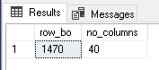

# Employee Database Analysis
## A. Return the Shape of the Table

```sql
-- Number of rows and columns
SELECT 
    (SELECT COUNT(*) FROM EmployeeData) AS row_bo,
    (SELECT COUNT(*) FROM INFORMATION_SCHEMA.COLUMNS WHERE TABLE_NAME = 'EmployeeData') AS no_columns;
```


## B. Gender Strength in Each Department

```sql
WITH GenderCounts AS (
    SELECT 
        Department,
        Gender,
        COUNT(*) as counts,
        SUM(CASE WHEN Gender = 'Male' THEN 1 ELSE 0 END) AS Males,
        SUM(CASE WHEN Gender = 'Female' THEN 1 ELSE 0 END) AS Females
    FROM 
        EmployeeData
    GROUP BY 
        Department,
        Gender
)
SELECT 
    Department,
    Gender AS ProminentGender,
    counts,
    RANK() OVER (PARTITION BY Department ORDER BY counts DESC) AS Gender_Rank
FROM GenderCounts;
```


## C. Create and Show Distribution of `AGE_BAND`

```sql
ALTER TABLE EmployeeData
ADD Age_Band NVARCHAR(50);

UPDATE EmployeeData
SET Age_Band = CASE 
    WHEN Age < 25 THEN 'Below 25'
    WHEN Age BETWEEN 25 AND 34 THEN '25-34'
    WHEN Age BETWEEN 35 AND 44 THEN '35-44'
    WHEN Age BETWEEN 45 AND 55 THEN '45-55'
    ELSE 'Above 55'
    END;

SELECT 
    Age_Band, 
    COUNT(*) AS Count
FROM EmployeeData
GROUP BY Age_Band;
```


## D. Compare All Marital Status and Find Most Frequent

```sql
-- Query to get marital status count and frequency rank
SELECT 
    MaritalStatus,
    Count,
    RANK() OVER (ORDER BY Count DESC) AS Freq_Rank
FROM (
    SELECT 
        MaritalStatus, 
        COUNT(*) AS Count
    FROM EmployeeData
    GROUP BY MaritalStatus
) AS _;
```


## E. Job Role with Highest Attrition Rate

```sql
WITH AttritionRate AS (
    SELECT 
        JobRole,
        (SUM(CASE WHEN Attrition = 'Yes' THEN 1 ELSE 0 END) * 100.0) / COUNT(*) AS Attrition_Percentage
    FROM EmployeeData
    GROUP BY JobRole
)
SELECT TOP 1
    JobRole,
    Attrition_Percentage
FROM AttritionRate
ORDER BY Attrition_Percentage DESC;
```


## F. Distribution of Employee's Promotion

```sql
SELECT YearsSinceLastPromotion, COUNT(*) AS EmployeeCount
FROM EmployeeData
GROUP BY YearsSinceLastPromotion
ORDER BY YearsSinceLastPromotion;
```


## G. Cumulative Sum of Total Working Years for Each Department

```sql
SELECT 
    Department,
    TotalWorkingYears,
    SUM(TotalWorkingYears) OVER (PARTITION BY Department ORDER BY TotalWorkingYears ROWS BETWEEN UNBOUNDED PRECEDING AND CURRENT ROW) AS Cumulative_sum_year
FROM EmployeeData;
```


## H. Rank Employees by Monthly Income Within Each Department

```sql
SELECT 
    EmployeeNumber,
    Department,
    MonthlyIncome,
    RANK() OVER (PARTITION BY Department ORDER BY MonthlyIncome DESC) AS Income_Rank
FROM EmployeeData;
```


## I. Running Total of Total Working Years for Each Employee

```sql
SELECT 
    EmployeeNumber,
    Department,
    AGE_BAND,
    TotalWorkingYears,
    SUM(TotalWorkingYears) OVER (PARTITION BY Department, AGE_BAND ORDER BY EmployeeNumber) AS Running_Total_Working_Years
FROM EmployeeData;
```


## J. Years Worked Before Leaving vs. Average Years in Department

```sql
WITH YearsWorked AS (
    SELECT 
        EmployeeNumber,
        Department,
        TotalWorkingYears AS Years_Worked_Before_Leaving
    FROM EmployeeData
    WHERE Attrition = 'Yes'
),
AvgYears AS (
    SELECT 
        Department,
        AVG(TotalWorkingYears) AS Avg_Years_Worked
    FROM EmployeeData
    GROUP BY Department
)
SELECT 
    Y.EmployeeNumber,
    Y.Department,
    Y.Years_Worked_Before_Leaving,
    A.Avg_Years_Worked
FROM YearsWorked Y, AvgYears A
WHERE Y.Department = A.Department AND Y.Years_Worked_Before_Leaving IS NOT NULL
ORDER BY
    Department,
    Years_Worked_Before_Leaving;
```


## K. Rank Departments by Average Monthly Income of Employees Who Have Left

```sql
WITH DepartmentIncome AS (
    SELECT 
        Department,
        AVG(MonthlyIncome) AS Avg_Monthly_Income
    FROM EmployeeData
    WHERE Attrition = 'Yes'
    GROUP BY Department
)
SELECT 
    Department,
    Avg_Monthly_Income,
    RANK() OVER (ORDER BY Avg_Monthly_Income DESC) AS Department_Rank
FROM DepartmentIncome;
```


## L. Relation Between Attrition Rate and Marital Status

```sql
SELECT 
    MaritalStatus,
    (SUM(CASE WHEN Attrition = 'Yes' THEN 1 ELSE 0 END) * 100.0) / COUNT(*) AS Attrition_Percentage
FROM EmployeeData
GROUP BY MaritalStatus;
```


## M. Department with Highest Attrition Rate

```sql
SELECT TOP 1 
    Department,
    (SUM(CASE WHEN Attrition = 'Yes' THEN 1 ELSE 0 END) * 100.0) / COUNT(*) AS Attrition_Percentage
FROM EmployeeData
GROUP BY Department
ORDER BY Attrition_Percentage DESC;
```


## N. Moving Average of Monthly Income Over the Past 3 Employees

```sql
WITH RankedEmployees AS (
    SELECT
        JobRole,
        MonthlyIncome,
        ROW_NUMBER() OVER (PARTITION BY JobRole ORDER BY EmployeeNumber DESC) AS rn
    FROM EmployeeData
)
SELECT
    JobRole,
    MonthlyIncome,
    AVG(MonthlyIncome) OVER (PARTITION BY JobRole ORDER BY rn ROWS BETWEEN 2 PRECEDING AND CURRENT ROW) AS MovingAverage
FROM RankedEmployees;
```


## O. Identify Employees with Outliers in Monthly Income

```sql
WITH IncomeStats AS (
    SELECT 
        JobRole,
        EmployeeNumber,
        MonthlyIncome,
        PERCENTILE_CONT(0.25) WITHIN GROUP (ORDER BY MonthlyIncome) OVER (PARTITION BY JobRole) AS Q1,
        PERCENTILE_CONT(0.75) WITHIN GROUP (ORDER BY MonthlyIncome) OVER (PARTITION BY JobRole) AS Q3
    FROM EmployeeData
)
SELECT
    EmployeeNumber,
    JobRole,
    MonthlyIncome,
    CASE
        WHEN MonthlyIncome < Q1 - (Q3 - Q1) * 1.5 THEN 'Low'
        WHEN MonthlyIncome > Q3 + (Q3 - Q1) * 1.5 THEN 'High'
        ELSE 'Not an Outlier'
    END AS OutlierType
FROM IncomeStats
WHERE MonthlyIncome < Q1 - (Q3 -

 Q1) * 1.5
   OR MonthlyIncome > Q3 + (Q3 - Q1) * 1.5;
```


## P. Gender Distribution Within Each Job Role

```sql
WITH GenderCount AS
(
    SELECT 
        JobRole,
        SUM(CASE WHEN Gender = 'Male' THEN 1 ELSE 0 END) AS Male_Count,
        SUM(CASE WHEN Gender = 'Female' THEN 1 ELSE 0 END) AS Female_Count
    FROM EmployeeData
    GROUP BY JobRole
)
SELECT
    *,
    CASE
        WHEN Male_count > Female_Count THEN 'Male'
        WHEN Female_Count > Male_count THEN 'Female'
        ELSE 'Equal'
    END AS Dominant_Gender
FROM
    GenderCount;
```


## Q. Percent Rank of Employees Based on Training Times Last Year

```sql
SELECT 
    EmployeeNumber,
    TrainingTimesLastYear,
    PERCENT_RANK() OVER (ORDER BY TrainingTimesLastYear) * 100 AS PercentRank
FROM EmployeeData;
```


## R. Divide Employees into 5 Groups Based on Training Times Last Year

```sql
SELECT 
    EmployeeNumber,
    TrainingTimesLastYear,
    NTILE(5) OVER (ORDER BY TrainingTimesLastYear) AS Training_Group
FROM EmployeeData;
```


## S. Categorize Employees Based on Training Times Last Year

```sql
WITH TrainingTimeTiling AS
(
    SELECT 
        EmployeeNumber,
        TrainingTimesLastYear,
        NTILE(3) OVER (ORDER BY TrainingTimesLastYear) AS TrainingTile
    FROM EmployeeData
)
SELECT 
    EmployeeNumber,
    TrainingTimesLastYear,
    CASE 
        WHEN TrainingTile = 3 THEN 'Frequent Trainee'
        WHEN TrainingTile = 2 THEN 'Moderate Trainee'
        ELSE 'Infrequent Trainee'
    END AS TraineeCategory
FROM TrainingTimeTiling;
```


## T. Categorize Employees as 'High', 'Medium', or 'Low' Performers

```sql
SELECT 
    EmployeeNumber,
    PerformanceRating,
    CASE 
        WHEN PerformanceRating >= 4 THEN 'High'
        WHEN PerformanceRating = 3 THEN 'Medium'
        ELSE 'Low'
    END AS PerformanceCategory
FROM EmployeeData;
```


## U. Categorize Employees into Work-Life Balance Categories

```sql
SELECT 
    EmployeeNumber,
    WorkLifeBalance,
    CASE 
        WHEN WorkLifeBalance = 1 THEN 'Poor'
        WHEN WorkLifeBalance = 2 THEN 'Fair'
        WHEN WorkLifeBalance = 3 THEN 'Good'
        ELSE 'Excellent'
    END AS Work_Life_Balance_Category
FROM EmployeeData;
```


## V. Group Employees Based on Stock Option Level

```sql
SELECT 
    EmployeeNumber,
    StockOptionLevel,
    NTILE(3) OVER (ORDER BY StockOptionLevel) AS StockOption_Group
FROM EmployeeData;
```


## W. Key Reasons for Attrition in the Company

```sql
SELECT 
    Attrition, 
    BusinessTravel, 
    Department,
    MaritalStatus,
    JobRole,
    AVG(MonthlyIncome) AS AvgIncome,
    COUNT(*) AS Count
FROM EmployeeData
WHERE Attrition = 'Yes'
GROUP BY Attrition, BusinessTravel, Department, MaritalStatus, JobRole
ORDER BY Count DESC;
```
