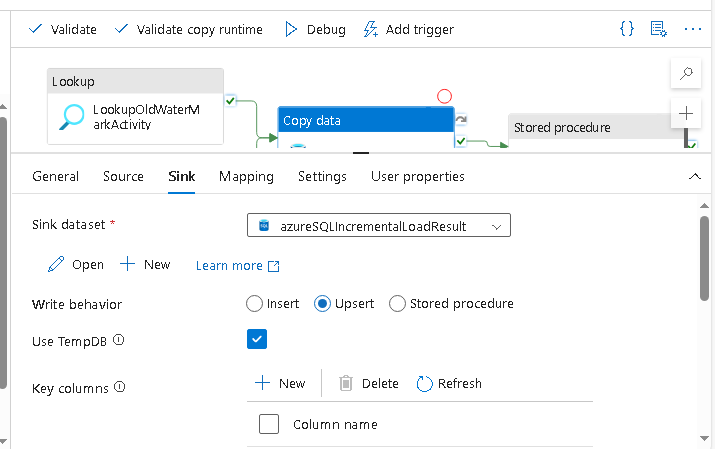

### 1. Design an ADF pipeline to copy data from an on-premise Azure SQL database to Azure Cosmos DB, ensuring data consistency and performance optimization. Pick correct options of partitioning for better performance.

### 2. Create Pipeline using Azure Data Flow in Azure Data Factory to apply Filter and Sort transformations on datasets.

### 3. Design an ADF pipeline to implement aggregate operations, such as sum, average, max, min and
count, within an Azure Data Flow.

### 4. Create best approach to bulk copy data from multiple homogenous sources into Azure SQL Database using ADF pipelines. Show usage of Lookup, For Each Loop and Expressions in Azure Data Factory.
- bulk copy using for each loop

  

### 5. Implement incremental load Pipeline in Azure Data Factory for handling datasets, ensuring efficient insert/upsert/updates to the target storage without re-inserting the entire dataset?

### 6. What are the key steps to connect Azure Databricks to Cosmos DB for real-time analytics and data transformation using spark and Databricks.
